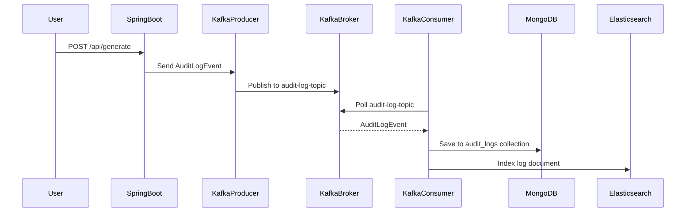

# rapid-crud-generator

Generate a ready-to-use RESTful API and Admin Dashboard from your JSON Schema — in seconds.

---

## 🚀 What is this?

**rapid-crud-generator** is a developer-friendly tool that automatically generates a backend (Spring Boot) and admin frontend (Angular) based on a user-provided JSON schema.

No boilerplate. No setup. Just schema in, code out.

---

## ✨ Features (MVP)

- 🔁 Upload or edit your JSON schema
- ⚙️ Auto-generate RESTful API (Spring Boot + JPA)
- 🎛️ Auto-generate Angular Admin Dashboard (CRUD)
- 📦 One-click zip download of the generated code
- 🛠️ Easily extend, run, or deploy the code
- 📊 Asynchronous Audit Logging with Kafka + MongoDB
- 🔍 Elasticsearch integration for searchable logs
- ⚡ Unified Async Task Service with built-in Prometheus metrics (success, failure, latency)
- 📈 Kibana + Prometheus + Grafana observability (Docker Compose)

---

## 📦 Output Structure
```
output/
├── backend/
│   ├── controller/
│   ├── entity/
│   └── repository/
└── frontend/
    ├── angular.json
    ├── package.json
    └── src/
        └── app/
            ├── user/
            ├── product/
            ├── app.module.ts
            ├── app-routing.module.ts
            ├── app.component.ts
            └── app.component.html

```

---

## 🚀 How to Use (Developer Mode)

### 1. Start backend (Spring Boot)
```bash
`cd backend
./mvnw spring-boot:run`
```

### 2. Explore API via Swagger UI
You can view and test the API in your browser:

🔗 http://localhost:8080/swagger-ui/index.html

### 3. Send your JSON schema via Postman or curl

Make sure your backend service is running at `http://localhost:8080`.

You can send your schema using `curl`:

```bash
curl -X POST http://localhost:8080/api/generate \
  -H "Content-Type: application/json" \
  -d @../example-schema.json
```
#### Example - example-schema.json
```json
{
    "schema": {
        "User": {
            "id": "Long",
            "name": "String"
        },
        "Product": {
            "id": "Long",
            "title": "String",
            "price": "Double"
        }
    }
}
```
📝 Note: 
* Make sure the path ../example-schema.json is correct. Adjust the path as needed based on your working directory.
* Alternatively, you can use Postman to send a POST request to /api/generate, with the schema in the request body and Content-Type: application/json.

### 4. A zip file will be generated in your project root

### 🔎 Search Audit Logs (Elasticsearch)

Endpoint: POST `/api/logs/search`

Example request:
```json
{
"action": "GENERATE",
"entity": "user",
"keyword": "Product",
"page": 0,
"size": 10
}
```
Searchable fields:
- action
- entity
- full-text keyword (applies to payload)
- pagination supported

View Kibana UI: http://localhost:5601

### 🍃 MongoDB Mode Support

By default, the backend is generated using **Spring Boot + JPA (SQL)**.

You can also generate **MongoDB-compatible code** using Spring Data MongoDB.

To enable it, simply add `"type": "mongo"` to your request:

```json
{
  "type": "mongo",
  "schema": {
    "User": {
      "name": "String",
      "email": "String"
    }
  }
}
```

---
📊 Asynchronous Audit Logging with Kafka + MongoDB (v1.1.1)
Every time `/api/generate` is called, a structured AuditLogEvent is sent to Kafka and then persisted asynchronously in MongoDB.

This allows the system to log all code generation activity without affecting the user experience.
> This feature is automatically triggered whenever code is generated.
> Updated and enhanced in v1.1.2 — now includes retries, DLQ, and Prometheus metrics.
### ✅ Flow Overview



### ✅ Example Payload

```json
{
  "action": "GENERATE",
  "entity": "User,Product",
  "payload": "{...originalRequest}",
  "timestamp": "2025-04-19T10:00:00"
}
```

### ✅ Technologies Used

| Layer       | Stack                                                                 |
|-------------|-----------------------------------------------------------------------|
| Kafka       | `spring-kafka`, `audit-log-topic`, `JsonSerializer/Deserializer`     |
| MongoDB     | `spring-boot-starter-data-mongodb`, `AuditLogDocument`               |
| Decoupling  | Non-blocking, fully async consumer                                    |

### ✅ MongoDB Configuration
In `application.yml`:

```yaml
spring:
  data:
    mongodb:
      host: localhost
      port: 27017
      database: rapid_crud_logs

```
You can explore audit_logs using [MongoDB Compass](https://www.mongodb.com/products/compass) or:

```bash
mongo
use rapid_crud_logs
db.audit_logs.find().pretty()
```

## 📚 Developer Docs

- [ObjectMapper Best Practices](./docs/object-mapper-best-practices.md)

## 🗭 Version History
### 📌 `v1.3.1` – Unified Async Task Service + Prometheus Observability

**Release date**: 2025-04-25  
This version focuses on improving asynchronous task management and enhancing system observability.

- ✅ Added `AsyncLogService` for unified async task execution
- ✅ Automatic metrics recording: success count, failure count, latency (including p95/p99 percentiles)
- ✅ Integrated Prometheus metrics collection for asynchronous tasks
- ✅ Grafana dashboards for real-time async task monitoring
- ✅ Enhanced Kafka audit log consumer with non-blocking Elasticsearch indexing

---
### 📌 `v1.1.2` – Kafka DLQ + Observability

**Release date**: 2025-04-21  
This version introduces production-level reliability and observability to the audit logging system.

- ✅ Kafka consumer retry logic with jitter delay
- ✅ Dead Letter Queue (DLQ) for failed messages
- ✅ Prometheus metrics for DLQ success count and processing duration
- ✅ Grafana dashboard integration via Docker Compose
- ✅ Clean separation of concerns for log collection vs. business logic

---
### 📌 v1.2.0 – Elasticsearch Search + Kibana Logs

- Add Elasticsearch client integration
- `/api/logs/search` REST endpoint
- Filter by `action/entity/keyword`
- Docker-compose support for Elasticsearch + Kibana

### 📌 `v1.1.1` – Initial Audit Logging (Async Kafka + MongoDB)

- Kafka producer sends `AuditLogEvent` on every `/api/generate` request
- MongoDB stores audit logs asynchronously
- Non-blocking architecture, full decoupling from main flow

---

### 📌 `v1.1.0` – Swagger UI & MongoDB Mode

- 🧭 Swagger UI integration at `/swagger-ui/index.html`
- 🍃 MongoDB mode supported with `"type": "mongo"` in schema requests
- 🛠️ Spring Data MongoDB integration for schema-driven document persistence

---
## 🧩 Customize Templates
All templates are located in `backend/src/main/resources/templates/:`

```
├── springboot/
│   └── Entity.ftl, Controller.ftl, ...
└── angular/
    └── table.component.ts.ftl, ...
```

You can add new code templates and adapt naming conventions, folder structure, or application layers.

Examples of custom templates you can add:

- ✅ **DTOs**: Generate data-transfer objects that hide sensitive fields.
- ✅ **Service layer**: Generate business logic classes to decouple controller and repository.
- ✅ **Pagination**: Generate REST APIs that support pagination parameters.
- ✅ **Permissions**: Add role-based access control annotations like `@PreAuthorize`.
- ✅ **i18n**: Output message keys for internationalization support.

You can define your own templates to meet your project needs.

---
## 🔮 Roadmap Ideas

- ☁️ **Web UI for Schema Editing & Live Preview**  
  Build an intuitive web interface where users can edit schema and see real-time code previews or generate live projects online.

- 🧠 **AI-assisted Schema Generation** ← ✨ New  
  Use AI to help users generate JSON schema based on natural language prompts like:  
  “I want a user table with email, password, and signup date.”

- 🌍 **OpenAPI / Swagger Support**  
  Accept `.yaml` or `.json` OpenAPI files and generate backend & frontend automatically.

- 🧱 **MongoDB / GraphQL Support**  
  Extend backend generators to support document databases and GraphQL endpoints.

- 🧩 **Plugin-based Template Extensions**  
  Allow developers to add or override templates easily (e.g., pagination, auth module, custom validation).

- 🎨 **Angular Themes & Dark Mode**  
  Let users pick UI themes for the generated frontend, including dark mode and layout styles.

---

💬 Feedback Welcome

Have ideas, bugs, or feature suggestions?

- Open an [Issue](https://github.com/xmyLydia/rapid-crud-generator/issues)
- Or simply leave a ⭐ and tell us what you liked!

We're listening. 
